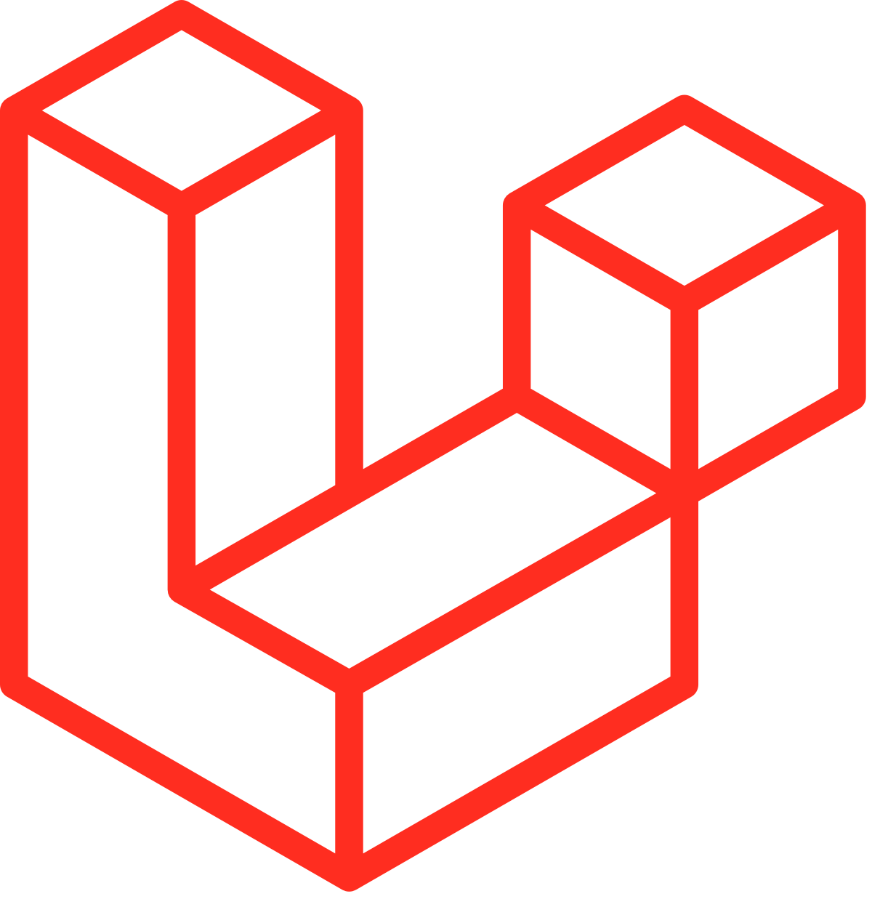
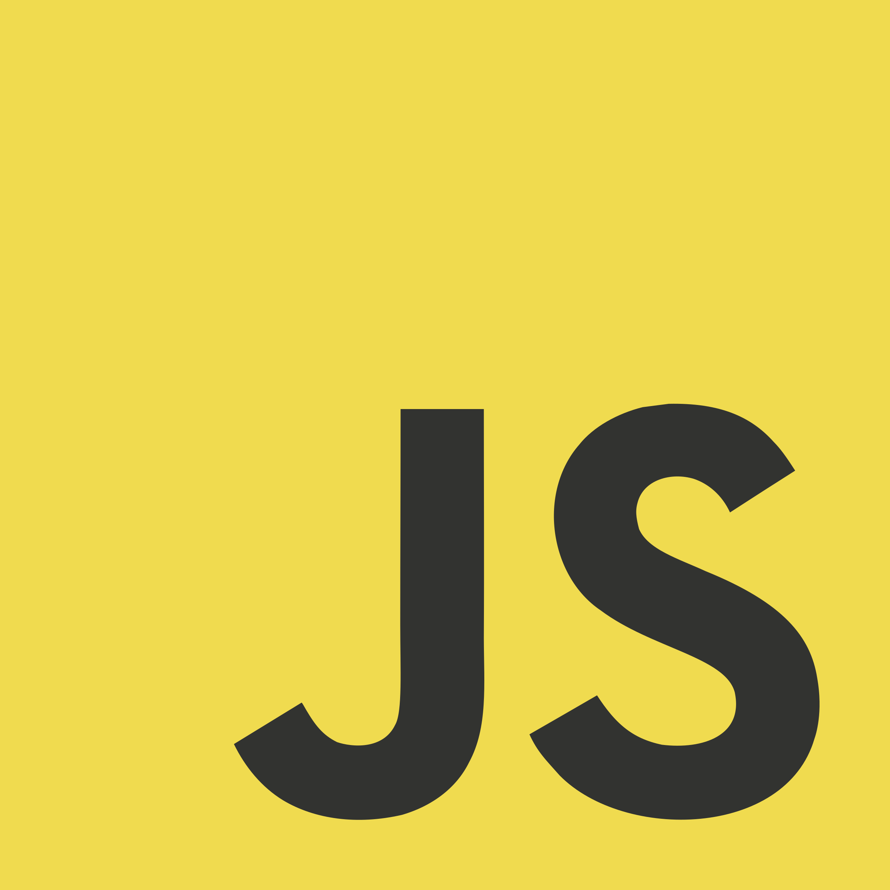

### Hi, I'm Huy  - [Đoàn Quang Huy][website] = Software Engineer 🌻

- 🔭 Passion in something ... (secret😊)
- 💪 Goals: Learning many things in Laravel
- ⭐: Gaming, listening, walking, running, Football... and talkative😅

### :zap: GitHub Stats

<table>
<tr>
  <td width="48%">
    
    
    
  </td>
   <td width="52%"></td>
</tr>
<table>

### Languages and Tools:

  
    

---

## 📫 Contact me:

### Email: quanghuybest@gmail.com
### 

[website]: https://daihoctrongtoi.blogspot.com/
